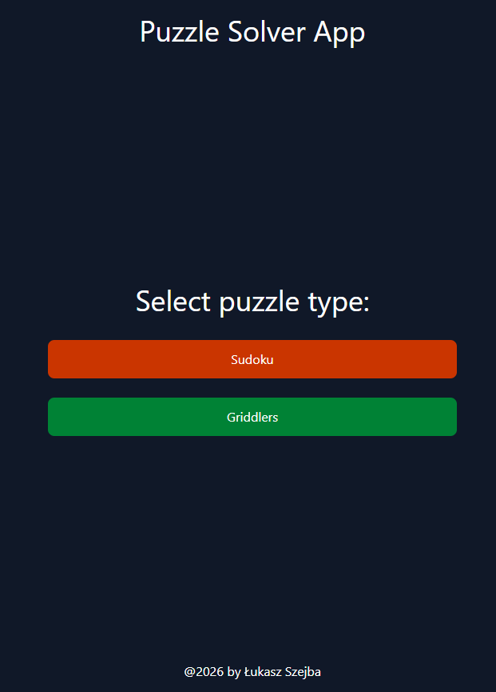
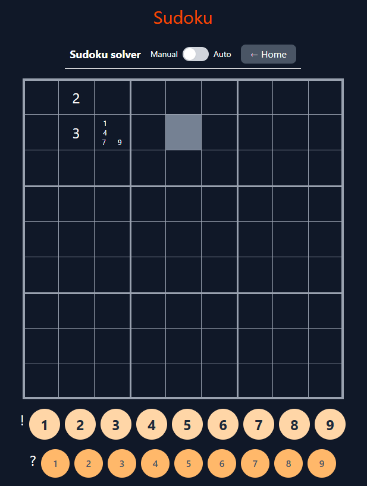

# Puzzle Solver Web App

This application has two main purposes (apart from being demonstration of Author's development skills, of course...):

1. Solving puzzles (such as Sudoku and Griddlers)

2. Learning how to solve these puzzles, step-by-step with explanation

Tech stack: React + TS (using Vite and TailwindCSS)

## Landing page

## Sudoku page

## Griddlers page

Work in progress
